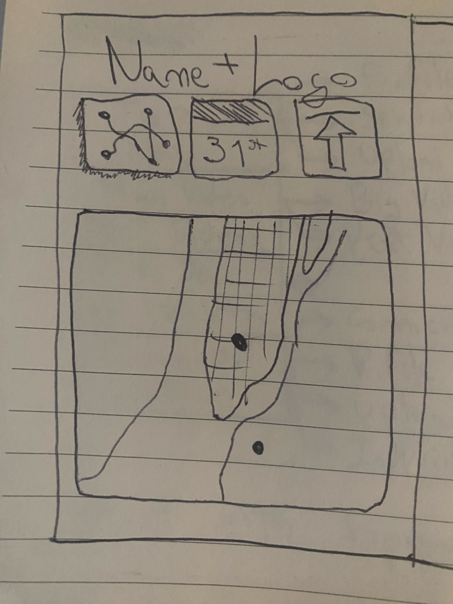
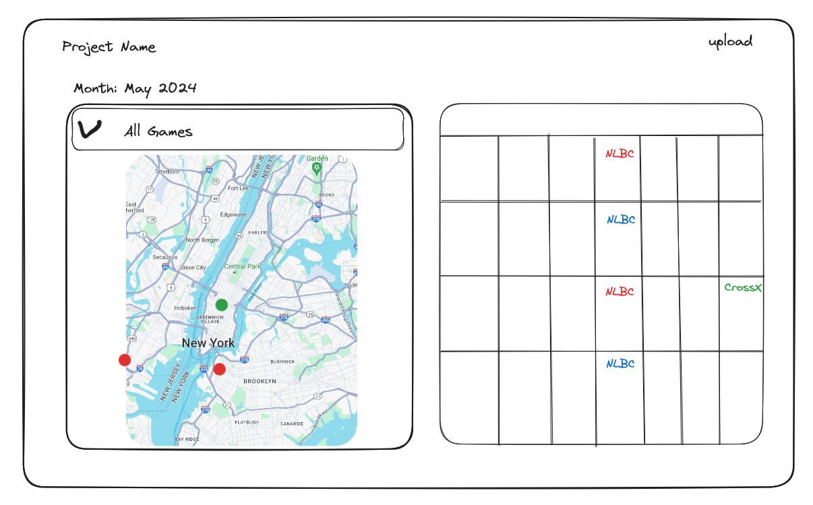

# HadoFinder

## Overview

HadoFinder is a react-based web application created to help fighting game players find their local communities and tournaments.

### Problem

Fighting games are a pretty niche interest and hobby, and the biggest appeal for a lot of people that are interested in them is the experience of attending in-person tournaments and interacting with their local community.
Unfortunately, because of the decline of Arcades during the last 15 years, it has become increasingly harder to find groups of people to play with in an offline setting, which turns some players away from the games entirely.
HadoFinder offers a solution to this problem, providing fighting game players with a platform to learn about the local events in their area.

### User Profile

This app will be used by members of the fighting game community, specifically ones interested in finding their local communities and don't know where to start.
Users will be able to provide their location, be it via geolocation technology or manual input, and see tournaments happening in their area during a selected month in an interactive map.

### Features

* Interactive map populated with real-time information of tournament locations.
* Calendar view with every event in your area.
* Data collected from popular tournament organizing website [start.gg](https://www.start.gg/).
* Tournament information will include name, date, URL, and location of the event.
* Ability to set month and distance radius.

## Implementation

### Tech Stack

* HTMl
* CSS
* SCSS
* JavaScript
* React
* Axios
* Leaflet
* React Lite Month Picker
* React Big Calendar
* Geolocation

### APIs

* [start.gg](https://developer.start.gg/docs/intro)

### Sitemap

HadoFinder is a single page application. However, this page will be divided into two distinct sections:

* Map: an interactive map which shows the location of tournaments in the user's vicinity.
* Calendar: a calendar which includes tournaments in the user's vicinity, shown in their specified dates.

### Mockups

### Data

The data utilized in this app consists of the response of a GraphQL API call to the [start.gg](https://developer.start.gg/docs/intro) API.
This response is issued with the following parameters:
* Coordinates: current coordinates of the user.
* Radius: Distance around the user's current coordinates.

The response body contains:
* Name of the event
* City it is held in
* Address of the venue
* Start date and time
* End date and time
* Latitude and Longitude
* URL

### Endpoints

This project will be using an external API.

### Auth

This site will not include Login or User Profile functionality, as it was not deemed necessary for the purposes and scope of the project.

## Installation Instructions

* Download the project files and open the parent folder using VSCode.
* In your terminal, CD into the parent folder and run the command `npm install`. This should install all the required dependencies for the project to work.
* Edit the provided `.env.sample` file, replacing the sample value in `VITE_SGG_KEY` with your [start.gg API key](https://developer.start.gg/docs/intro).
* Rename `.env.sample` to `.env`.
* In the terminal, run the command `npm run dev` and open the link in your browser. Chrome or Firefox preferred.
* For BrainStation education team: a [start.gg API key](https://developer.start.gg/docs/intro) will be provided to you directly for ease of use.

## Roadmap

Step 1 - Setup:
* Create react app boilerplate and file structure.
* Download necessary packages and dependencies.
* Download necessary assets.
* Set up routes, pages and components.
* Expected duration: 1-2 days.

Step 2 - Map:
* Display an interactive map using the Leaflet library.
* Display the user's current location in the map using Geolocation API.
* Display a radius around the user.
* Expected duration: 3 days.

Step 3 - API:
* Learn GraphQL to be able to make API calls to start.gg.
* Formulate a request body to get the desired response, taking into account the needed parameters.
* Display a coherent response body in the console.
* Expected duration: 1 day.

Step 4 - Show Data in Map:
* Learn how to add more markers in Leaflet.
* Utilize the tournament array in the API response to create markers for each tournament in their exact location.
* Expected duration: 3 days.

Step 5 - Calendar:
* Display a calendar of events using React-Big-Calendar.
* Style the calendar to fit website dimensions and styling.
* Utilize the tournament array in the API response to populate the calendar.
* Create modals that display more information when clicking on a certain event.
* Expected duration: 3 days.

Step 6 - Styling:
* Finish website styling.
* Make website responsive for Desktop, Tablet, and Mobile.
* Expected duration: 1-2 days.

## Nice-to-haves

* Aditional server which would allow users to submit their own tournaments in the case of them not being hosted in start.gg.
* Authentication feature so users can save their locations. (Relational database, Users table stores users, events table stores events, favorites table stores user IDs and event IDs correspondent to that user) (Work in Progress)
* Filtering tournaments by games. (Done)
* Letting users adjust distance radius of tournaments shown. (Done)
* Allowing users to search for tournaments in other areas. (Done)
* Selecting a tournament in the calendar highlights said event in the map. (Done)